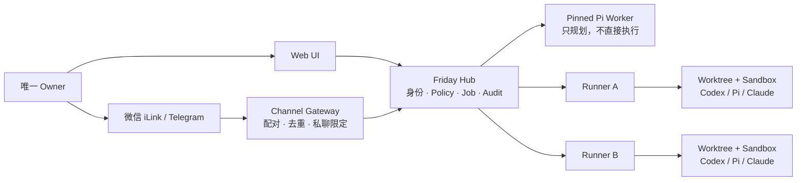

# Friday Agent

[English](README.en.md) | 中文

Friday Agent 是一个单用户、自托管的私人设备管家。你通过 Web、微信 iLink 或 Telegram 和它对话；Hub 负责身份、策略、审计和调度，轻量 Runner 在受控节点上执行任务。模型不会直接拿到 SSH、Root、Docker socket 或长期供应商密钥。

> 当前版本：`v0.2.1`。面向愿意自行部署和审查安全边界的早期用户。首版外部入口仅包含 Web UI、微信 iLink 和 Telegram Bot。

## 它能做什么

- 用 Web 控制台对话，查看设备、任务、Diff、制品和待授权操作。
- 接收文字、图片和短视频；在受支持的浏览器中连续语音识别、朗读和开口打断。
- 在微信 iLink 扫码绑定后收发私聊；通过 Telegram Bot 接受唯一 Owner 的私聊。远端任务完成、失败或取消后，Gateway 会持久化重试并回推终态和有界结果摘要。
- 自动选择已登记、在线且能力匹配的节点：通用 Remote Agent 使用独立临时运行目录，Codex、Pi 或 Claude Code 使用独立 Git Worktree；两者都进入无网络 Sandbox。
- 通过 Hub 提供受限网络搜索；MCP、Skill 和 Procedure 默认关闭，启用前需要来源、版本、能力和回放证据。
- 让外部模型提出 Pi 升级或架构改进，但只能先生成隔离补丁和测试证据。涉及联网安装、重启、部署、凭据、Root 或删除时，Friday 必须说明背景、风险和回滚方案，并申请 R2/R3 clearance。



## 设计边界

- **单 Owner**：这不是多租户 SaaS，也不是群聊机器人。
- **Hub 是控制根**：保存策略、审批、设备身份、会话和审计；始终只监听 `127.0.0.1:4310`。
- **Runner 只出站**：登记后主动访问 Hub，不开放 Friday 管理端口；SSH 只用于首次安装和升级。
- **执行强隔离**：Worktree 不是 Sandbox。真实工具必须经 root-owned `friday-sandboxd` 进入固定内容 ID 的容器。
- **通用 Agent 能力**：Remote Agent 自主规划并组合系统、进程、服务、日志、网络和受限文件工具；Hub 对每次调用单独分级与签名，不按具体诊断场景写分支。
- **凭据留在 Hub**：Runner 为当前签名 Job 换取短时模型令牌，节点不保存长期模型 Key。
- **默认拒绝**：配置不完整、设备离线、能力不匹配、租约过期、签名错误或 clearance 缺失时不执行。

## 推荐部署：Tailscale

推荐让 Hub 和所有受控节点加入同一个 Tailnet：Hub 继续监听 loopback，由 Tailscale Serve 提供 Tailnet 内 HTTPS；Runner 通过该 HTTPS 地址主动连接 Hub。不开 Funnel，也不需要开放 `4310`、Runner RPC 或 Sandbox 端口。

Hub 要求：Linux、Docker Engine、Docker Compose v2、OpenSSL、curl，以及已连接的 Tailscale。先确认你知道该节点的 Tailnet HTTPS Origin，然后执行：

```sh
git clone https://github.com/JimiZhou/friday-agent.git
cd friday-agent
sudo ./deploy/hub/install-hub.sh \
  --origin https://friday-hub.example-tailnet.ts.net \
  --network tailscale
```

安装器会：

1. 创建低权限 `friday-hub` 用户和私有状态目录；
2. 生成 Owner Token、Web 密码、Gateway control/ingest token；
3. 构建并启动 loopback Hub 与独立 Channel Gateway；
4. 配置 `tailscale serve`，但绝不启用 Funnel；
5. 输出 Web 地址和一次性展示的 Owner 凭据。

打开 Web 控制台后，可在“设备”页面直接生成微信 iLink 二维码并扫码确认。

### 配置 Telegram

先从 `@BotFather` 获取 Bot Token，并确认自己的数字 Telegram user ID。不要把 Token 写进 shell history；在当前 shell 中静默读取后调用配置脚本：

```sh
read -r -s FRIDAY_TELEGRAM_BOT_TOKEN
export FRIDAY_TELEGRAM_BOT_TOKEN
export FRIDAY_TELEGRAM_OWNER_ID='123456789'
sudo --preserve-env=FRIDAY_TELEGRAM_BOT_TOKEN,FRIDAY_TELEGRAM_OWNER_ID \
  ./deploy/hub/configure-telegram.sh
unset FRIDAY_TELEGRAM_BOT_TOKEN FRIDAY_TELEGRAM_OWNER_ID
```

Gateway 只接受这个 Owner 的私聊，拒绝群聊、其他 sender 和消息重放。

## 快速纳管子节点

运行 `fridayctl` 的机器需要 Node.js `>=22.19.0`。目标节点需要 Linux/systemd、Node.js `>=22.19.0`，并已有服务用户以及 root 或免交互 `sudo`。先构建本地管理工具：

```sh
npm ci --ignore-scripts
npm run build
```

推荐使用节点的 Tailnet 主机名，并先把 SSH host key 写入 `known_hosts`。执行前总是查看 dry-run：

```sh
npm run fridayctl -- runner bootstrap node-user@managed-node.example-tailnet.ts.net \
  --hub-url https://friday-hub.example-tailnet.ts.net \
  --runner-name managed-node-01 \
  --service-user node-user \
  --workspace node=/srv/friday-nodes/node \
  --identity-file "$HOME/.ssh/friday_agent" \
  --dry-run
```

确认后，通过环境变量提供 Owner Token，再去掉 `--dry-run`：

```sh
read -r -s FRIDAY_OWNER_TOKEN
export FRIDAY_OWNER_TOKEN
npm run fridayctl -- runner bootstrap node-user@managed-node.example-tailnet.ts.net \
  --hub-url https://friday-hub.example-tailnet.ts.net \
  --runner-name managed-node-01 \
  --service-user node-user \
  --workspace node=/srv/friday-nodes/node \
  --identity-file "$HOME/.ssh/friday_agent"
unset FRIDAY_OWNER_TOKEN
```

轻量 Runner 上线后只能汇报状态。要实际运行 Codex、Pi 或 Claude Code，目标机还需 Docker，并由 Owner 对一次联网构建和服务重启授予 R2 clearance：

```sh
npm run fridayctl -- runner sandbox install node-user@managed-node.example-tailnet.ts.net \
  --hub-url https://friday-hub.example-tailnet.ts.net \
  --service-user node-user \
  --identity-file "$HOME/.ssh/friday_agent" \
  --dry-run
```

安装器固定并验证 `@openai/codex@0.145.0`、`@earendil-works/pi-coding-agent@0.84.1` 和 `@anthropic-ai/claude-code@2.1.227`，失败时恢复旧 release。Runner 后续升级使用 `fridayctl runner upgrade`，保留原设备身份、Hub pin 和 Workspace Registry。

`node` 只是目标节点的本地能力标识，路径只需是一个受控的现有目录，不需要 Git。只有提交给 Codex/Pi/Claude 的源码 Workspace 才必须是 Git 顶层目录。Remote Agent 会根据目标自主组合结构化节点工具；没有真实节点观察时不能直接宣称完成，单个工具失败会作为观察返回给 Agent 重新规划。遇到 R1-R3 调用时保存有界观察上下文并暂停，iLink/Telegram 主动通知，Owner 在 Web 核对精确参数后继续。授权超过当前租约不会执行旧调用，而是签发新租约让 Agent 重新规划。

## 不使用 Tailscale

可以，但必须自己提供满足以下条件的网络：

- Hub 仍保持在 `127.0.0.1:4310`，由现有私网 HTTPS 反向代理暴露；不要把 Friday 端口直接映射到公网。
- Web 浏览器和所有 Runner 都能访问同一个 `FRIDAY_PUBLIC_ORIGIN`，TLS 证书有效。
- 目标节点预先安装 SSH 公钥并建立 `known_hosts` 信任。`fridayctl` 强制 `BatchMode=yes`、`PasswordAuthentication=no` 和 `KbdInteractiveAuthentication=no`，不支持 SSH 用户名密码登录。

Hub 安装命令改为：

```sh
sudo ./deploy/hub/install-hub.sh \
  --origin https://friday.internal.example \
  --network private-https
```

SSH 公钥建议通过云厂商控制台、镜像初始化或现有可信运维通道安装。若只能用密码完成首次 `ssh-copy-id`，完成后应关闭服务端密码登录；Friday Agent 不保存或代填 SSH 密码。

## 模型与工具配置

Hub 默认在未配置模型时 fail closed。真实对话和远端 CLI 执行所需变量见 [`deploy/hub/hub.env.example`](deploy/hub/hub.env.example)：

- Conversation Pi：`FRIDAY_PI_*`
- Runner 上的 Codex/Pi：`FRIDAY_RUNNER_OPENAI_*`
- Runner 上的 Claude Code：`FRIDAY_RUNNER_ANTHROPIC_*`
- 私有 STT/TTS：`FRIDAY_VOICE_*`

长期 Key 只写入 Hub 上 root-owned、`0600` 的 `deploy/hub/hub.env`。不要提交该文件，也不要把 Key 复制到 Runner。

## 本地开发与验证

```sh
nvm use
npm ci --ignore-scripts
npm test
npm audit --audit-level=moderate
git diff --check
```

本地 Hub 默认监听 `127.0.0.1:4310`：

```sh
npm run dev:hub
curl -fsS http://127.0.0.1:4310/health
```

## 文档

- [完整部署与回滚](deploy/README.md)
- [架构、信任边界与状态机](docs/architecture.md)
- [M3 扩展运行边界](docs/m3-operations.md)
- [同类项目取舍](docs/github-landscape.md)
- [安全策略](SECURITY.md)

## 项目状态与非目标

已验证的核心包括：Web/iLink/Telegram 消息边界，多 Runner 调度，图片/视频输入，浏览器对讲，通用 Remote Agent 与逐调用 Node Tool Policy，固定 Codex/Pi/Claude CLI 的 Sandbox HTTP 合约，真实节点工具的多步循环，短时模型凭据代理，以及 Self Improvement 的测试证据、R2/R3 clearance 和 Canary 门禁。公开测试使用受控模型 fixture；每次生产部署仍必须使用自己的 Provider 完成只读 Remote Agent E2E。

`v0.2.1` 仍不承诺 macOS/Windows Runner 安装器、自建 WebRTC 音频流、开放插件市场、多租户、无人审批生产变更或自治 Root 运维。Self Improvement 当前不会自动 Push `main`；真实部署切换仍需要明确 clearance 和受控发布流程。

## License

[Apache License 2.0](LICENSE)。Friday Agent 与微信、Telegram、OpenAI、Anthropic 和 Pi 项目均无隶属或官方背书关系；各外部服务受其自身条款约束。
