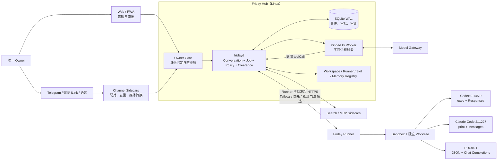
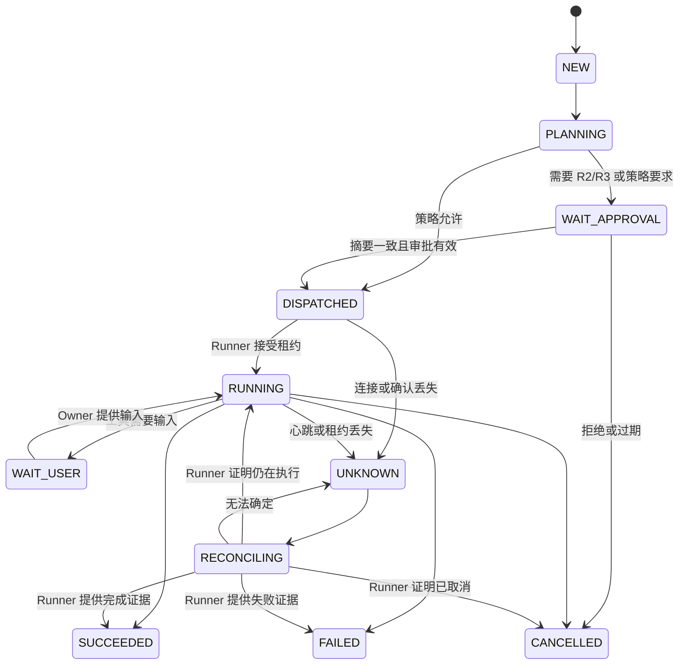

# Friday Agent 架构设计

> 状态：M1–M3 受控基础 + M4 Fleet 首段 + M5 文本 Conversation Orchestrator + 自我迭代 clearance 基础；外部 provider 与未验证适配器默认禁用
> 适用范围：单用户、自托管、以远程开发与排障为首要闭环
> 更新日期：2026-08-12

除明确标为“已实现”的段落外，本文描述的是目标架构与运维门槛。签名租约、Sandbox/Runner 链路、渠道配对/重放、自动 Fleet 选择、持久会话、图片/视频输入、浏览器连续对讲和自补丁状态机均已完成验证。参考 Linux Hub/Runner 部署已完成真实 iLink 与 Codex/Pi/Claude 三条远端 E2E；真实主机、Tailnet 和 Provider 配置不进入公开仓库。外部 MCP 与未配置 Provider 仍默认拒绝。

## 1. 产品定义

Friday Agent 是一个只服务于一位 Owner 的自托管 Agent 控制面。它把 Web、Telegram、微信 iLink 和语音中的自然语言意图，转换为可审计、可审批、可恢复的远程任务。通用 Remote Agent 可自主规划并组合节点工具；Codex、Claude Code、Pi 是可选的专业执行器，不再按每个诊断场景增加硬编码适配。

Friday 不是通用聊天平台，也不是让大模型直接持有 SSH、Root 和生产密钥的“万能机器人”。系统的根本边界是：

- **Pi 负责理解与规划，但不拥有最终执行权。**
- **Hub 的策略与审批结果决定“能不能做”。**
- **Runner 在目标机再次验证任务，决定“本机是否接受”。**
- **所有副作用都属于持久化 Job，而不是一次脆弱的聊天调用。**

首要设计目标：

1. 单用户身份清晰，任何渠道都不能仅凭显示名称获得权限。
2. Hub、Runner 或网络重启后，任务可以恢复或对账，不盲目重放副作用。
3. Pi、模型、渠道、MCP、Skill 均可替换；任一 Sidecar 故障不拖垮核心控制面。
4. 默认最小权限，路径、网络、Secret、费用和时限全部显式声明。
5. 升级频率由 Owner 决定，固定版本、先验证、可回滚，不跟随上游自动更新。

## 2. 单用户与信任边界

### 2.1 Owner 模型

系统只存在一个逻辑 Owner。首版日常入口只有 HTTPS Web Basic Auth、已扫码绑定的微信 iLink 和已配置的 Telegram Bot；浏览器语音属于 Web 会话内输入。`channel + sender_id` 只有在 Web/本机部署流程完成配对后，才映射到唯一的 `owner_id`。

兼容入口 `/v1/messages` 仍只接受 Owner Token 保护的 Web 消息。M2 Channel Gateway 使用独立、哈希保存的 ingest token 写入 `/v2/inbound`，Hub 再校验配对、重放与群聊拒绝；请求体里的 `senderId` 与 `authStrength` 本身仍不是认证证明。

必须遵守以下不变量：

- 首次 Owner 初始化只能在 Hub 本机控制台或一次性本地引导页完成。
- 新渠道、新设备和新 Runner 的绑定必须由已认证的 Web 管理面确认。
- Tailscale 节点身份、IM 登录态和语音声纹只是认证信号，不单独构成授权。
- Telegram、微信和语音可以提出高风险操作，但不能批准 R2/R3 操作。
- 所有 Channel Sidecar 默认拒绝群聊；即使未来开放，也只接受已绑定 Owner 的定向消息。
- 删除或轮换渠道身份后，已有 Session 可以保留审计记录，但不能继续执行新操作。

### 2.2 信任区域

| 区域 | 组件或数据 | 信任判断 |
| --- | --- | --- |
| 控制根 | `fridayd` 策略引擎、Owner 密钥、审批验证器、签名密钥 | 可信、保持最小且确定性 |
| 推理区 | Pi Worker、远端模型输出 | 不可信规划者，输出必须经过 Schema 与策略校验 |
| 执行区 | 已登记 Runner、Sandbox、工具适配器 | 节点可信但仍需本机策略复核 |
| 边缘区 | IM、语音、Web 输入、MCP、搜索、网页和附件 | 外部不可信输入，可能包含提示注入 |
| 供应链 | Pi、Codex、Claude、Skill、容器和 npm 依赖 | 固定版本并在升级前验证 |

可信家庭网络不等于无条件可信。Hub 不应暴露到公网；默认仅监听 loopback 或 Tailnet。Runner 凭据泄露、IM 账号被盗、MCP 返回恶意内容和目标仓库内提示注入都必须纳入威胁模型。

## 3. 总体架构



部署最小单元是一个 Hub、一个独立 Pi Worker 和至少一个 Runner。Web 静态资源可由 `fridayd` 直接提供；IM、语音、MCP、搜索和模型网关均为可停止、可替换的 Sidecar。MVP 不依赖 PostgreSQL、Redis、Kafka、Kubernetes 或插件市场。

## 4. 核心组件

### 4.1 `fridayd`：确定性控制面

`fridayd` 是唯一事实源，职责包括：

- Owner 身份绑定、Session 和 Channel 消息去重。
- Job 状态机、事件序号、租约、超时、取消与断线对账。
- 确定性策略计算、R0-R3 风险分级和审批验证。
- Runner、Workspace、工具能力、Skill 和 Memory Registry。
- 对 JobSpec 做规范化序列化、摘要和签名。
- 保存审计事件，并向 Web/渠道输出经过脱敏的进度。
- 管理 Pi Worker 生命周期，但不信任其工具参数或执行结论。

M0 骨架最初以带单写锁和 SHA-256 链的 JSONL 实现 `EventStore`，用于验证消息幂等、重启恢复和防篡改检测。当前 M1 基础已在保持接口与 v1 协议不变的前提下迁移到 SQLite WAL：事件哈希链仍会校验，数据库损坏或链不一致会 fail closed，并只对已验证的旧 `events.jsonl` 做一次性导入；旧文件保留，不自动删除。

M0 的新 `message.accepted` 事件只落盘规范化 `messageId`、消息摘要和 Job，不保存消息正文或附件 URI。状态恢复仍兼容早期 full-message 事件，但旧日志本身不会因此被改写或自动脱敏，必须继续按敏感数据保护并在正式迁移时处理。

M5 新增 `conversations_v1` 与 `conversation_turns_v1`。它们位于 Owner 私有 SQLite 中，会保留受限长度的用户原文和 Assistant 回复，以便 Pi Worker 重启后重建上下文；这些明文不进入哈希链审计导出。`channel + message_id` 绑定规范内容摘要：相同内容返回原 Turn，不同内容冲突。崩溃时仍处于 `QUEUED/THINKING` 的 Turn 会明确标记 `FAILED/AGENT_INTERRUPTED`，不会把 Prompt 接收回执误判为回复。

持久数据使用 SQLite WAL。最低限度应有 `identities`、`devices`、`sessions`、`messages`、`jobs`、`job_events`、`approvals`、`runners`、`workspaces`、`memory_candidates`、`skills` 和 `audit_events`。大日志与制品放到按 Job 隔离的本地对象目录，数据库只存元数据、摘要和相对引用。

### 4.2 Pi Worker：固定版本的推理隔离层

Pi Worker 以独立进程或容器运行固定版本的 [`earendil-works/pi`](https://github.com/earendil-works/pi) `pi --mode rpc`。M0 最初核验基线为 `v0.83.0`；当前部署 pin 已升级到 `@earendil-works/pi-coding-agent@0.84.1`，并通过真实 RPC smoke 与 0 漏洞 audit。实际发布仍必须固定包锁、运行时镜像和制品 SHA-256，而不是只记录标签。

`fridayd` 不依赖 Pi 的内部 TypeScript API，只依赖 `PiWorkerAdapter`：

```text
start | prompt | steer | followUp | abort | getState | events | compact | close
```

Pi Worker 的约束：

- 使用独立低权限账户或容器，不挂载 Owner home 和 Hub Secret 目录。
- 默认无任意 Shell、SSH 和宿主机文件访问能力。
- 只获得当前 Session 所需上下文和作用域化工具。
- 远程执行只暴露 `remote_job_start/status/input/cancel/artifacts`，禁止模型拼接任意 SSH 命令。
- MCP、联网搜索、Memory 写入和 Secret 请求均经 Hub/Broker 代理。
- Worker 崩溃只使对应推理请求失败；Job 事实和 Runner 任务不丢失。
- Worker 传输采用严格 LF JSONL；每条完整记录（不含结尾 LF）最多 1 MiB，拒绝 CR/CRLF 和超限单行。
- M0 Worker 在单进程内最多保留 4096 个规范请求摘要及原响应；达到上限后继续服务已缓存 replay，但 fail closed 拒绝所有新 ID，需重启 Worker 才能建立新的有界缓存。
- 生产环境设置 `PI_SKIP_VERSION_CHECK=1` 和 `PI_TELEMETRY=0`，禁止自动更新。
- Conversation 使用全新、单 Turn 的临时 Pi Session，并等待 Pi RPC `agent_settled` 事件；`prompt` 的 success response 只代表接收，不代表推理完成。
- Hub 推理 Worker 固定使用 `--no-tools --no-extensions --no-skills --no-prompt-templates --no-context-files`。模型只能输出回复或受限 Job 提案，不能直接读取仓库、执行 Shell、拼接 SSH、指定 Runner、风险或审批。

### 4.3 Runner：目标机执行代理

Runner 安装在受控开发机或服务器上，主动连接 Hub；Hub 不要求目标机开放 Friday RPC 端口。首选 Tailnet 内 HTTPS，替代模式使用用户已有的私网 TLS 入口。Tailscale 只提供网络与节点身份，Runner 仍必须校验 Hub pin、签名 JobSpec、租约和本机策略。

当前 Runner 已使用逐设备 Ed25519 身份、出站 HTTPS、签名租约、私有 Workspace 注册表、Remote Agent 临时运行目录、专业执行器 Git Worktree 和 root-owned Sandbox 接口。Owner 签发十分钟、一次性的登记令牌；`fridayctl` 可通过已知 SSH 主机完成 Linux 节点预检、编译产物下发和首次登记，Token 以 `0600` 文件交接并在成功后删除。SSH 不进入日常 Job 协议。

M4 Fleet 调度器允许 Job 请求只描述 Workspace 与工具，由 Hub 在已登记、在线、非降级、具备 `sandbox` capability、Workspace 匹配且适配器已由 Owner 启用的 Runner 中选择当前负载最低者。选择结果立即固化为明确 `runner_id` 并进入签名 JobSpec；调度器不能启用适配器、安装 Sandbox、修改 Workspace 或放宽审批。Runner-only SSH bootstrap 因未安装 Sandbox 而只会上线，不会成为可执行候选。

每个 Runner 维护：

- 独立、可撤销的设备密钥与 `runner_id`。
- `workspace_id -> canonical root` 的本地登记表；JobSpec 不允许提交任意绝对路径。
- 支持的 Sandbox 等级、工具适配器、网络策略和资源上限。
- 持久执行日志、步骤 Checkpoint、`job_id + attempt` 幂等记录。
- Remote Agent Runtime、通用 Node Tool Broker，以及 Codex/Pi/Claude 固定非交互专业适配器。

Runner 必须先解析并校验真实路径，再创建独立 Git Worktree 或临时 Workspace。当前实现把两者都限定在 `FRIDAY_RUNNER_STATE_DIR/jobs/<job_id>/worktree`：Remote Agent 的节点能力目录不要求 Git，Codex/Pi/Claude 的源码 Workspace 仍要求 Git 顶层目录。模型运行时交给 root-owned `friday-sandboxd`。Supervisor 只启动固定内容 ID 的无网络容器：Remote Agent/Pi 使用 JSON 输出 + Chat Completions，Codex 使用 `codex exec --json` + Responses，Claude 使用 `--print --output-format stream-json` + Messages。Remote Agent 只能提出结构化 Node Tool Call；Hub 按能力逐次计算 R0-R3、绑定参数摘要并签名，Runner 再验签后调用本地通用工具。暂停时 Runner 以 `0600` Checkpoint 保存完整有界观察链、待授权调用和下一事件序号；审批超出租约时旧调用作废，Agent 在新租约下重新规划。每个 Job 只有一个只读 Unix 模型 socket；长期 Provider Key 留在 Hub，短期令牌只在 sandboxd 内存中。

第一版通用工具包括系统快照、进程列表、服务状态、Journal、监听端口、受限文件读取与搜索。它们不是“资源诊断”“日志诊断”等场景 API，Agent 可根据任意目标组合调用。Remote Agent 至少取得一次真实节点观察后才可 `finish`；单个已授权工具的本地失败会作为有界观察返回，使模型可以改用其他安全原语，而授权验签或控制面失败仍会关闭任务。观察链按步数、单次字节数和 Checkpoint 总量设限。文件工具拒绝进程环境、凭据、私钥和 Friday/Tailscale 等敏感路径；递归搜索先筛选有界候选文件，所有文本结果再做凭据脱敏。`file.write`、`service.restart`、`process.signal`、`command.exec`、`file.delete` 等能力已经进入协议和策略分级，但副作用执行默认关闭；需要时必须先展示精确调用背景，经 Web clearance 后再逐项开放。绑定 IM 的任务在暂停时会进入独立 clearance outbox，主动提示 Owner 去 Web 授权，不会占用最终结果通知。

Runner 的本机策略可以比 Hub 更严格，不能更宽松。SSH 仅作为无法安装 Runner 时由 Owner 显式启用的 break-glass 路径，不属于常规执行协议。

### 4.4 Sidecar

Sidecar 通过窄接口接入，不直接修改 Job 或调用 Runner：

- **Channel Sidecar**：完成平台收发、媒体下载、消息去重和统一消息转换；不负责授权。
- **Voice Sidecar**：VAD、STT、TTS 分离；Web 已支持连续浏览器识别、回复朗读和开口打断，并以录音后转写作兼容回退。它依赖浏览器语音服务；自建 WebRTC 音频流和常驻唤醒不在当前边界内。
- **MCP/Search Broker**：仅启动白名单 Server，固定版本与 Schema Hash，限制超时、响应大小、网络出口和 Secret Scope。
- **Model Gateway**：按任务预算和数据策略选模型；记录供应商、模型、用量与错误，不把长期凭据交给 Pi。

每个 Channel Sidecar 必须使用只能写入指定 channel 的独立、可轮换 Ingest 凭据，不能获得 Owner Token、事件读取、审批、Job 管理或 Runner 调度权限。该凭据边界与 Hub 侧身份配对校验是开放 M2 Sidecar 前的硬门槛。

任何 Sidecar 被停止后，Web 中的基本对话、Job 管理和远程执行仍应可用。

## 5. 版本化协议

协议定义位于 `packages/protocol/schemas/`，所有顶层消息都包含严格常量 `protocolVersion: "1"`。M0 的四个边界 Schema 为：

| Schema | 边界 | 作用 |
| --- | --- | --- |
| `inbound-message.v1.schema.json` | Channel/Web -> Hub | 统一文本、附件、回复关系、发送者与认证强度 |
| `pi-worker-envelope.v1.schema.json` | Hub <-> Pi Worker | 请求、事件、工具调用、取消与相关 ID 的传输信封 |
| `job-spec.v1.schema.json` | Hub -> Runner | 不可变任务清单：目标、权限、预算、隔离和审批绑定 |
| `runner-envelope.v1.schema.json` | Runner -> Hub | 设备签名的注册、心跳、Job Event、制品和对账信封；调度清单由 JobSpec 单独承载 |

协议测试覆盖 Web、Telegram、微信 iLink 和语音形状。外部渠道只能通过 M2 作用域化 Ingest 凭据进入，并同时通过唯一 Owner 配对、私聊限定和 replay 校验；兼容 `/v1/messages` 不接受伪造外部 channel。

协议层必须遵守：

1. 边界输入先做大小限制和 JSON Schema 校验，再进入业务逻辑。
2. 每条消息都有全局 ID、关联 ID 和时间戳；重复消息返回同一结果，不重复产生副作用。
3. 每个 Runner Job Event 必须带单调递增 `sequence`；Hub 只接受连续事件，缺口触发 Reconcile。
4. JobSpec 采用规范化 JSON 计算摘要并由 Hub 签名。摘要投影必须排除签名本身和审批证明，避免循环哈希；审批绑定该摘要，而不是绑定一句自然语言。
5. `protocolVersion: "1"` 内只允许新增可选字段；删除、重命名或改变语义必须升级协议版本。
6. Hub 只在兼容矩阵内调度 Runner；滚动升级至少支持当前版与上一兼容版并存。
7. 未知版本、未知消息类型、过期租约和签名失败一律 fail closed，并形成审计事件。

正式可执行的 JobSpec 至少描述：`job_id`、幂等键、目标 `runner_id`、`workspace_id`、工具与动作、文件能力、网络白名单、Secret Scope、Sandbox 等级、CPU/内存/时限/费用预算、租约、审批要求、不可变摘要和 Hub 签名。当前 M0 的 `job-spec.v1` 只验证无执行能力的基础清单；进入 M1 调度前必须以新协议版本补齐执行字段，不能静默放宽 v1。Secret 只传引用；Runner 按 Job 和短时租约兑换，Secret 不进入 Prompt、普通日志或制品。

## 6. Job 状态机与恢复



规则：

- 状态转换由 Hub 事务提交，同时追加 Job Event；禁止仅在内存中推进。
- `DISPATCHED` 只表示已发出，Runner 返回带租约的 Accepted 后才能进入 `RUNNING`。
- Hub 或 Runner 重启后先用最后事件序号、执行 ID 和本地步骤日志对账。
- `UNKNOWN` 不是失败。涉及 Push、删除、部署、重启等副作用时，未知结果不能自动重试。
- 自动重试仅适用于显式标记为幂等的步骤，并复用相同幂等键。
- Cancel 是请求，不是假设；只有 Runner 确认进程树终止后才能进入 `CANCELLED`。
- Terminal Job 不可回退；继续工作必须创建新的 Job，并通过 `parent_job_id` 关联。

典型执行链为：输入去重 -> Owner 认证 -> Pi 生成候选计划 -> Hub 解析为 JobSpec -> 策略分级 -> 必要时审批 -> 签名调度 -> Runner 本机复核 -> Sandbox 执行 -> 事件流与制品 -> Hub 验证终态证据 -> 回复 Owner。

## 7. 权限与审批

| 等级 | 典型操作 | 默认决策 | 审批通道 |
| --- | --- | --- | --- |
| R0 只读 | 查询状态、读取受限日志、代码搜索、健康检查 | 已登记范围内自动允许 | 无 |
| R1 隔离写 | 独立 Worktree 修改、测试、生成 Patch | 可按 Workspace 给予限时授权 | Web 可撤销授权 |
| R2 外部副作用 | Git Push、联网安装依赖、服务重启、创建外部资源 | 每个 JobSpec 单独审批 | Owner Web Session + CSRF/Origin |
| R3 特权/不可逆 | Root、删除、生产切换、密钥或安全策略修改 | 默认拒绝，显式开启后双确认 | Owner Web Session + 精确 clearance；可选第二凭据 |

风险按“能力”而不是按命令字符串判断。例如通过脚本间接执行 `git push` 仍属于 R2。Policy Engine 应综合操作、节点、Workspace、环境、文件范围、网络、Secret、资源预算和执行工具计算等级。

审批对象展示完整 Manifest 摘要：目标节点、仓库与分支、工具、命令/动作、路径、网络目的地、Secret Scope、预算、有效期和预期副作用。审批包含 nonce、过期时间、Owner 凭据和 JobSpec digest；任一字段变化即使旧审批失效。

## 8. 安全基线

### 8.1 必须实施的控制

- Web 默认只在 loopback/Tailnet 提供。单 Owner Basic Auth 密码只保存在 root-owned 环境文件中，认证失败有限流；所有浏览器写操作同时校验固定 Origin 和非简单请求头，避免 Basic 凭据被跨站请求滥用。
- Hub 和 Runner 使用独立最小权限系统账户；Hub 数据库、签名密钥、渠道 Token 和 Runner 密钥分目录授权。
- Runner 仅建立出站连接，设备证书可单独吊销；公网连接必须使用 mTLS 和短时租约。
- Sandbox 显式挂载 Workspace，默认拒绝宿主 home、Docker socket、SSH agent 和其他仓库。
- Job 网络默认关闭，按域名/IP、端口和时限开放；依赖安装与 MCP 网络和工具网络分开授权。
- 外部网页、仓库内容、附件和 MCP 结果标记来源，不允许其中的指令提升权限或改变 Policy。
- 日志在落盘前脱敏，禁止记录 Authorization、Cookie、私钥、模型 Key 和完整 Secret 值。
- Artifact 使用内容摘要，下载时再次校验；HTML/Markdown 预览禁用主动脚本。
- Skill 必须有版本、来源、内容摘要和能力清单；带脚本 Skill 只在 Runner Sandbox 执行，Agent 不得自行安装或更新。

### 8.2 明确不作出的安全承诺

- 家庭部署不等于绝对安全；拥有 Hub 管理员或目标机 Root 的攻击者仍可绕过系统。
- 仅有 Worktree 不是 Sandbox。没有 OS/容器级隔离时，系统不得宣称文件不可越界。
- LLM 生成的计划、测试通过和终端输出都不是独立可信证明；高风险结果仍需可验证的系统证据。
- 审计日志默认是可追溯而非防管理员篡改；如需更强保证，应将摘要定期导出到独立介质。

## 9. Memory、Skill 与自我迭代

长期学习与自我迭代采用“候选 -> 隔离变更 -> 验证 -> 低风险自动采纳 / 重大变化 clearance -> Canary -> 可撤销”，不做隐式在线训练：

| 类型 | 内容 | 晋级条件 |
| --- | --- | --- |
| Episode | 某次任务发生了什么 | 自动保存脱敏摘要并设置保留期 |
| Candidate | 从纠正或重复行为提取的候选偏好 | 显示来源、置信度和影响范围 |
| Preference | Owner 确认的稳定偏好 | Owner 明确确认，可随时删除 |
| Procedure | 可复用操作流程或 Skill | Sandbox 回放验证、能力审查、版本化启用 |

M1 起使用 SQLite + FTS5 即可，不提前引入向量数据库；M0 仍是 JSONL 恢复骨架且没有 Memory 功能。Memory 不能自动授予网络、Secret、定时任务或更高风险等级。

Friday 对自身的迭代只允许从 `FRIDAY_SELF_WORKSPACE_ID` 指定的源码 Workspace 取回补丁，并登记到 `friday/self/*` 隔离分支。模型只能给出结构化 `selfImprovementProposal`，Hub 派生改进 ID、分支、Runner 和 R1 Job。自我改进记录必须说明类别（Pi 升级、架构、能力、安全或依赖）、背景、预期收益、风险、回滚方案和所需动作，并绑定源 Job、补丁 SHA-256 与测试证据。测试证据由 Runner 生成，绑定 Hub 签名的 Job Manifest、固定执行镜像、输出与补丁摘要；模型文本、未预绑定的普通 Job 和其他私人 Workspace 不能晋级。Hub 根据声明动作、补丁路径和新增命令重算 clearance：普通联网安装、服务重启和 Canary 为 R2；Policy、凭据、Root、删除或生产切换为 R3。模型不能提交风险等级或“已批准”状态。

低风险自我迭代会自动启动预绑定的隔离 R1 Job，完成补丁和可信测试证据后由 `TESTED` 自动进入 `ADOPTED`，向 Owner 汇报 brief，不要求额外授权。`ADOPTED` 只表示已采纳为下一次受控发布候选，不表示当前生产版本已经变化。Hub 会根据真实补丁路径、新增命令和所需动作重新判断；联网/依赖、服务重启、Canary、Git Push、Policy/凭据/Root、删除和生产切换会自动生成 clearance 请求。clearance 是带随机 ID 和 Manifest SHA-256 的持久对象，只有匹配的 Owner Basic Auth 请求才能从 `WAIT_APPROVAL` 进入 `CLEARED` 并启动 Canary。当前实现不会自行 Push `main`；真实部署切换必须继续经过受控发布与回滚流程。

## 10. 版本与运行治理

稳定性优先于追随上游：

1. Node、Pi、Codex/Claude 适配器、npm 依赖、Schema 和容器均精确锁定；禁止 `latest` 和宽范围生产依赖。
2. 发布制品记录 lockfile、SHA-256、构建信息和兼容矩阵；可行时生成 SBOM。
3. Pi 使用 `current`/`next` 两套镜像。`next` 必须通过 RPC、Session、Compaction、Steer、Abort、工具调用、崩溃恢复和长上下文契约测试。
4. 默认按月或更低频人工升级；安全修复可加急，但仍需 Canary 和回滚演练。
5. Runner 先 Canary，Hub 后升级；调度前检查协议、能力和版本，不把新字段发给不兼容节点。
6. 数据库迁移前做一致性备份，采用可回滚或 expand/contract 迁移；无降级路径的版本不得覆盖 `current`。
7. 出现错误率、任务恢复或契约回归时，停止调度新 Job，保留进行中执行的对账能力，并一键切回 `current`。

运维最低要求包括：Hub 健康检查、Runner 最后心跳、队列深度、未知状态 Job、审批积压、模型/MCP 用量、磁盘空间和备份年龄。备份必须实际做恢复演练；备份不应包含可直接复用的明文 Secret。

## 11. 交付里程碑、非目标与验收

### M0：协议与安全骨架

范围：Monorepo、四个 v1 Schema、`fridayd`/Pi Worker/Runner 空壳、可替换 EventStore、JSONL 恢复基线、健康检查和契约测试。

非目标：真实执行 Shell、IM/语音接入、任意 Skill、MCP、生产部署。

验收：

- `npm ci --ignore-scripts && npm run check` 在固定 Node 版本下通过。
- 四个边界对有效样例接受、对未知版本/缺字段/越界大小拒绝。
- Hub 重启后能读回 Job 与事件；重复消息不产生第二个 Job。
- Runner Skeleton 只能声明能力，不能执行任意命令。

### M1：一台开发机的可靠闭环

范围：Web 输入与 Owner Session、Tailnet Runner、一个登记 Workspace、强制 Sandbox、独立 Worktree、Codex 结构化适配器、实时事件、Diff/测试制品、停止和恢复。

非目标：微信、Telegram、常驻语音、多 Runner 自动调度、生产 Root 运维、自更新。

验收：

- 从 Web 提交任务，Pi 规划后由 Runner 在独立 Worktree 完成修改与测试，Web 展示进度、Diff 和结果。
- 每个 Runner 使用独立、可吊销并绑定 `runner_id` 的设备凭据；共享 M0 Runner Token 不能进入 Tailnet 或执行链路。
- Agent 无法读取或修改登记 Workspace 与显式挂载之外的文件。
- Git Push 始终生成新的 R2 审批，未批准时 Runner 本机也拒绝。
- Hub、Runner 分别在任务中途重启，恢复后通过事件序号对账，不重复执行已完成步骤。
- 断网发生在副作用确认前时 Job 进入 `UNKNOWN/RECONCILING`，不会盲目重跑。
- Pi `next` 契约失败时，可切回 `current` 且既有 Job/Session 事实不丢失。

### M2：日常交互与可用性

范围：Telegram Long Polling、微信 iLink Sidecar、Web Push-to-talk/语音消息、STT/TTS、通知、Memory Candidate 与 Owner 确认。

非目标：群聊机器人、移动原生 App、持续麦克风监听、声纹单独授权、高风险 IM 审批。

验收：

- 同一平台消息重放、Sidecar 重启和网络抖动不会创建重复 Job。
- 每个 Channel Sidecar 只能持有作用域化 Ingest 凭据，无法读取 Owner 数据或调用审批、Job 与 Runner 管理接口。
- 未配对 sender、群聊消息和过期媒体默认拒绝并留下脱敏审计。
- 语音转写结果在执行前可查看；R2/R3 仍只能转到 Web 完成审批。
- 停掉任一 Channel/Voice Sidecar 后，Web 与正在运行的 Job 不受影响。
- Memory Candidate 可查看来源、确认、纠正、导出与删除；未确认内容不成为稳定偏好。

### M3：受控扩展与自我改进

范围：MCP/Search Broker、签名 Skill、Claude/Pi 执行适配器、多 Runner 授权与显式选择、Procedure 晋级、Friday 自身补丁与 Canary 流程。

非目标：多租户、开放插件市场、Agent 自动安装/升级、无人审批生产变更、自治 Root 运维、无限递归多 Agent。

验收：

- MCP/Skill 的网络、文件、Secret 和时间预算可被策略独立限制；恶意返回无法提升权限。
- 删除 MCP/Search Sidecar 后，核心远程开发闭环仍可运行。
- Procedure 必须经过来源展示、Sandbox 回放和 Owner 启用，且能回滚到上一版本。
- Friday 只能向隔离分支生成自身补丁；测试、Diff、R2/R3 审批、Canary 和失败回滚均有审计证据。
- 单个 Runner 或工具适配器故障不会错误地把 Job 标为成功，也不会影响无关 Runner。

### M4：私人设备 Fleet 纳管

范围：SSH 首次部署轻量 Runner、Runner-only 可复现发布包、一次性文件式登记、确定性多节点选择、节点能力/负载可见性。

当前已实现：Linux/systemd SSH bootstrap、编译产物发布包、自动选择 API、私有图片/视频存储与多模态 Pi 输入、浏览器连续对讲、通用 Remote Agent/Node Tool 协议，以及 `fridayctl runner sandbox install` 的联网镜像构建、真实 CLI 合约门禁和失败自动回滚。尚未实现 macOS/Windows 安装器、高风险通用工具的实际副作用执行和自建 WebRTC 音频流。

验收：

- Owner Token 不进入命令行、systemd 环境或长期节点配置；登记文件成功后删除。
- Runner-only 节点能上线但无 `sandbox` capability，不能被自动调度执行任务。
- 自动选择只使用 Hub 已验证事实，并把最终 Runner 固化进签名 JobSpec。
- 相同候选负载下按 Runner ID 稳定选择；离线、降级、未登记、Workspace/适配器不匹配节点均被排除。

### M5：Conversation Orchestrator

范围：Owner Web/iLink 文本会话、Pi Worker 生命周期、持久 Turn、受控 Tool Call、结构化回复/Job 提案、自动 Fleet 选择与原有 R0/R1 审批链复用。

当前已实现：`POST /v4/conversations/:id/messages`、会话/Turn 查询、Web/iLink/Telegram 回复链、图片/视频媒体生命周期、多模态 Pi 请求、浏览器连续对讲与开口打断、固定 `web_search`/`fleet_status` 工具、严格模型输出、崩溃 fail closed、R0 自动派发、R1 等待审批，以及受限 `selfImprovementProposal` 到预绑定 R1 候选任务。公开安装仍需用户提供自己的模型与可选 STT/TTS 配置。

### M6：受控自我迭代

范围：模型提出 Pi/依赖升级和架构优化、隔离补丁、测试证据、风险背景说明、Owner clearance、Canary 与回滚。

当前已实现：模型结构化提案、Hub 自动启动预绑定 R1 隔离任务、源 Job 意图绑定、Runner 测试证据、低风险候选自动进入 `ADOPTED`、重大变化由 Hub 派生 R2/R3、clearance ID/Manifest 绑定、`CLEARED` 与 Canary 门禁。尚未实现：周期性且默认关闭的发现器、独立部署执行器、真实 Pi current/next 双轨 Canary 和自动回滚证据采集。

## 12. 当前关键决策

- 采用 **Hub + Pinned Pi Worker + Outbound Runner + Sidecars**，不 Fork OpenClaw，也不复制其多用户、多渠道大一统范围。
- Pi 是可替换的推理引擎，不是权限边界、远程传输层或长期状态库。
- Tailscale 是默认网络路径，但 Friday 自己负责应用层身份、签名、审批和租约。
- 所有实际工作都建模为可恢复 Job；聊天 Session 只负责上下文与展示。
- SQLite WAL 是单机控制面的首选；只有实际测量证明容量或并发不足时才引入外部数据库。
- Web 是管理与高风险审批的权威界面；IM 和语音首先服务于低摩擦输入与通知。
- 稳定发布采用人工升级、契约测试、Canary 与 `current`/`next` 回滚，不自动追随 Pi 或工具上游。

同类开源项目的逐项边界核验与取舍记录在 [GitHub 同类项目调研](github-landscape.md)。
